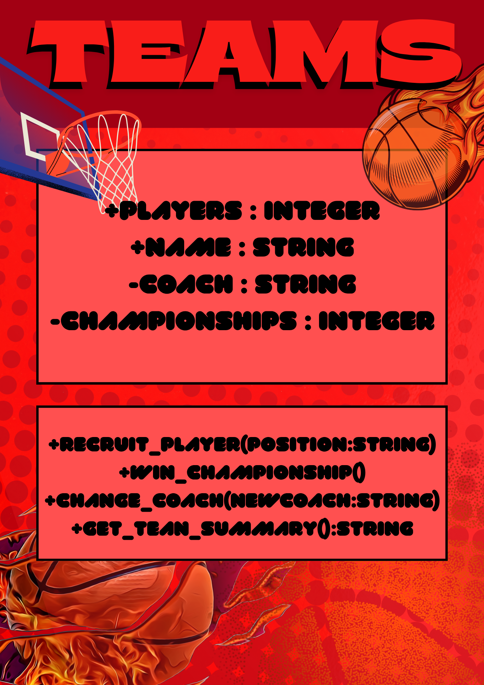
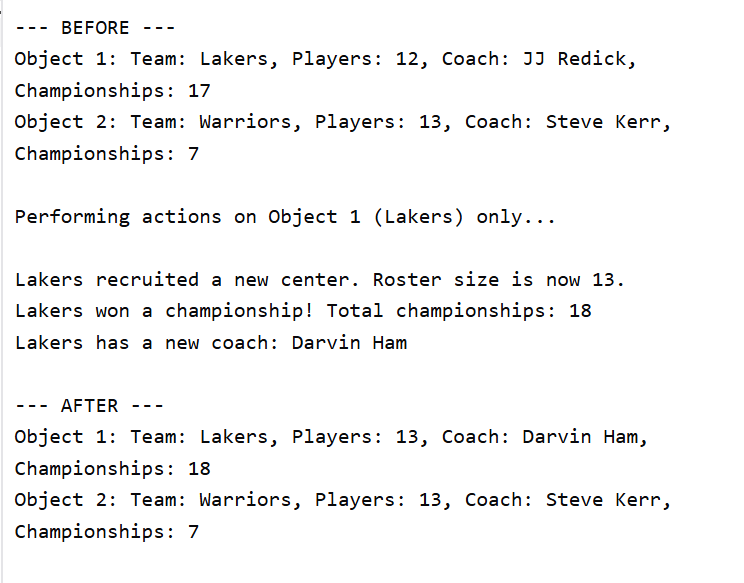
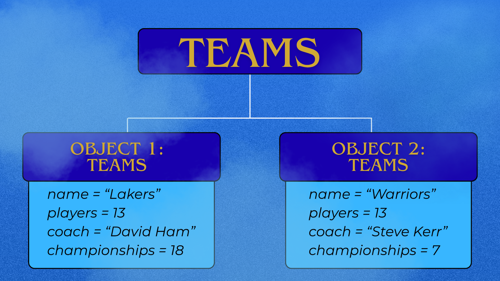

# Class Attributes and Methods
## Previous Design
Link to my previous activity:
[classObjectUML.md](classObjectUML.md)
## Design Revision
I renamed my methods and added a new one so its more specific.
## Visibility Decisions
| Attribute | Data Type | Visibility | Reason |
|---|---|---|---|
|Players |int |Public |The number of players are often checked. |
|Name |string |Public |The team's name should be publically displayed|
|Coach |string |Private |The coach can only be changed deliberately, so it should be protected |
|Championships |int |Private |Same as "Coach", it should be protected, because it could only increase one at a time. |
## Updated UML Class Diagram

## Python Implementation
[View Python Source](classImplementation.py)
## Test Run

## Object Diagram

## Analysis
### Why did you make your chosen attribute private?
I made "Championships" private because it can only be changed in a certain way, increasing one at a time. If it was public, a part of the program could set it to a nonsensical value. Keeping it private, protects it.
### Which method changes the state of your object?
"recruit_player(postion)" changes the public "players" attribute by increasing it by one each time its called, refering to a new player joining. "win_championship()" changes the private "championships". And "Change_coach(NewCoach) changes the private "Coach".
### How did your two objects demonstrate that instances are independent?
Both objects were created from the same class but started with different values. After calling recruit_player(), win_championship(), and change_coach(), it gave different outputs. This confirms each object keeps its own separate copy of the attributes defined in "__init__()". 
### What is the difference between your class diagram and your object diagram?
The class diagram shows the team in general, its attribute names, data types and methods. While the object diagram shows two specific objects, with their actual current value. In short, the class diagram is the blueprint while the object diagram is a snapshots of objects built from that blueprint.