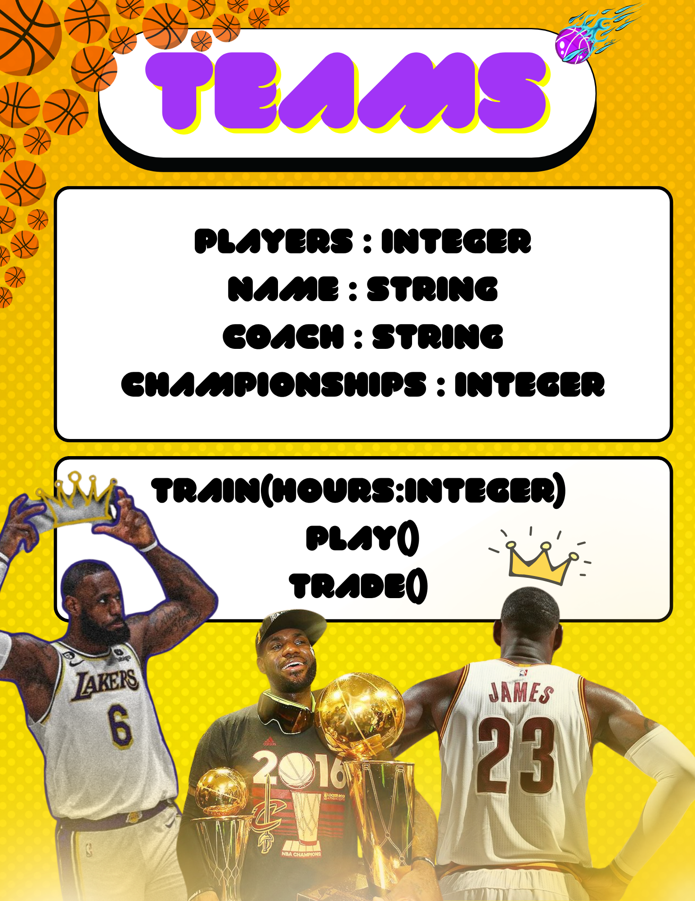

# SG4 - Understanding Classes and Objects
## Class Name: NBA Team
## Class Description: The "NBA Team" class refers to a professional basketball team in the NBA. It stores information about the team like their championships, players etc.
## Properties
| Property | Data Type | Description |
|---|---|---|
|Players |integer |Number of players in the team |
|Name |string |Name of the team |
|Coach |string |Name of the coach |
|Championships |integer |Number of championships won |
## Methods
| Method | Description |
|---|---|
|Train |Trains the team for a set number of hours |
|Play |Participation of the team |
|Trade |Moves player to a different team |
## Class Diagram

## Design Explanation
### Why did you choose this class?
I chose this class because I'm a really big fan of the NBA, and the teams acts a role model for me. This class shows identificational information about a team in the NBA.
### Which property is the most important? Why?
Name is the most important property because it is needed so that we could identify the team.
### Which method is the most useful? Why?
Train is the most useful method because it shows how active the team is in training.

