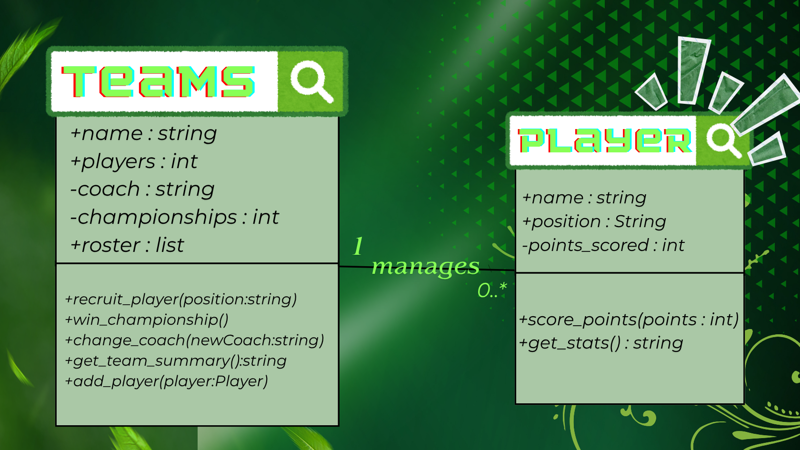
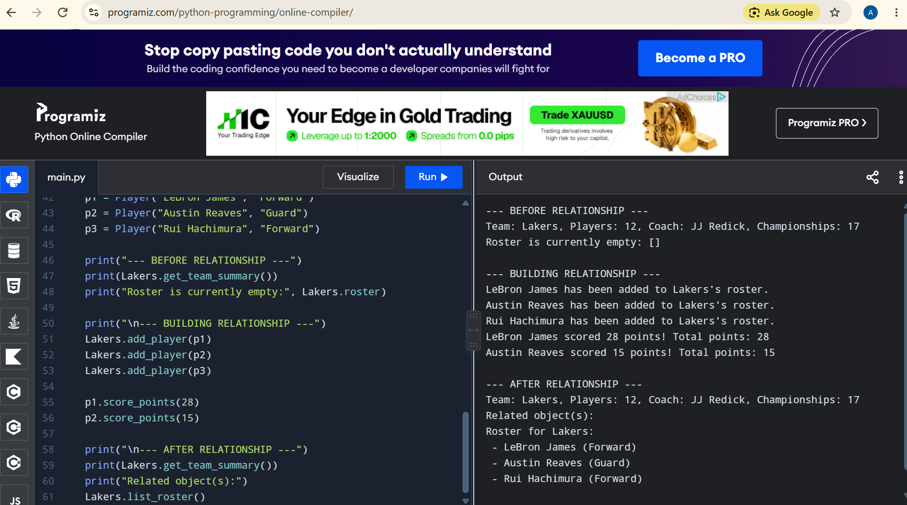
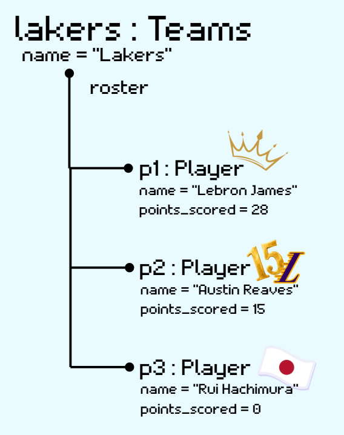

# Class Relationships: Association and Multiplicity
## Previous Work
[Part I - Classes and Objects](classObjectUML.md)
[Part II - Class Attributes and Methods](classAttributesMethods.md)
## Existing Class
Class: Teams
Description: The "Teams" class refers to a professional basketball team in the NBA. It stores information about the team like their championships, players etc.
## New Related Class
Class: Player
Description: The "Player" class represents an individual basketball player, their name, position and points scored.
## Association
Relationship: "Teams" manages "Player"
Explanation: A team can't exist without its players, and a player always belong in a team. So, it made sense to connect them since many actions require "Teams" to hold onto "Player" rather than the roster count.
## Multiplicity
Multiplicity: 1 -- 0..*
Explanation: Every player, belongs to a team, so the "Teams" side is 1. A team can have many players on its roster, including zero before a player is recruited, that is why 0 or more fits better than requiring one. 
## UML Class Relationship Diagram

## Python Implementation
[View Python Source](classRelationships.py)
## Test Run

## Object Relationship Diagram

## Analysis
### What is the association between your two classes?
"Teams" manages "Player". "Teams" always have a list called "roster" that hold the "Player" objects recruited to the team. This means the team can interact or manage with its players, rather than just knowing the number of players.
### What multiplicity did you choose and why?
I chose 1--0..*, where one team can have 0 or more players. I chose this because a team that is new might not have a recruit and there is no fixed upper limit for players in the team. But the number of players in the team can not be super high like 100 players.
### How did you implement the relationship in Python?
The "Teams" class stores the relationship in self.roster, a list that starts as [] in __init__(). The method add_player(player) appends an actual "Player" to that list. list_roster() loops in self.roster to access the players through player.get_stats().
### Why did you store an object reference instead of copying its data?
I store an object reference instead of copying its data into the team. This matters because when a method is called like p1.score_points(28), the roster automatically reflects that updated total. If I had copied the data as a plain string, the team would not be able to see the players stats.
### If your relationship uses many, why is a list appropriate?
A list is approprite because the number of players in the team can expand or shrink as it is not fixed to one value. The list self.roster contains "Player", not just their name or stats. Calling a method will work correctly.